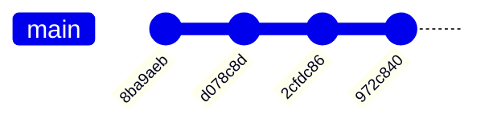

# Math formulas
## Area
- Circle: S = πR²
- Rectangle: S = ab
- Square: S = a²

## Perimeter
- Circle: P = 2πR
- Rectangle: P = 2a + 2b
- Square: P = 4a

some test text
----

## Functions

### Circle 
- area(r) -- takes a float or int value in, returns an area (int or float)
- circumference(r) -- takes a float or int value in, returns a circumference (int or float)

### Rectangle
- area(a, b) -- takes two float or int values in, returns an area (int or float)
- perimeter(a, b) -- takes two float or int values in, returns a perimeter (int or float)

### Square
- area(a) -- takes a float or int value in, returns an area (int or float)
- perimeter(a) -- takes a float or int value in, returns a perimeter (int or float)

### Triangle 
- area(a, h) -- takes two float or int values in, returns an area (int or float)
- perimeter(a, b, c) -- takes three float or int values in, returns a perimeter (int or float)

----

